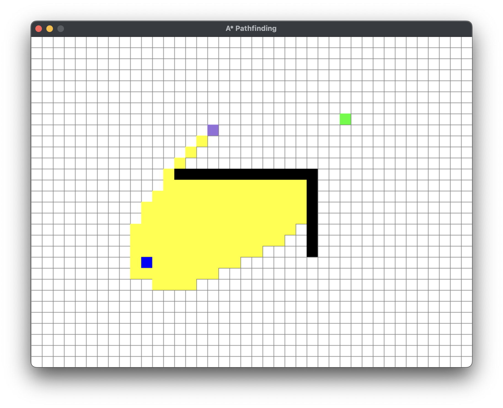
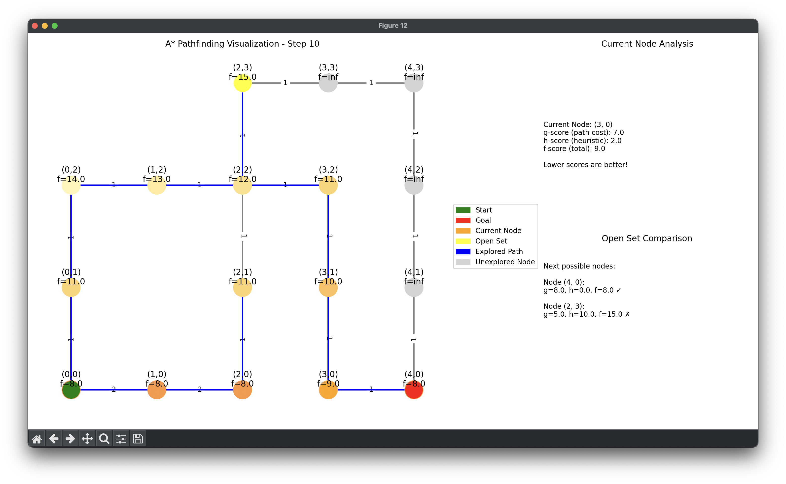

# 🌟 A* Algorithm

Welcome to the A* Algorithm repository! This project features a Python implementation of the A* (A-star) algorithm, a widely-used pathfinding and graph traversal technique. It's commonly applied in AI for games, robotics, and geographic information systems.

## ✨ Features

- 🚀 Efficient pathfinding using the A* algorithm
- 🔍 Supports various heuristics (e.g., Manhattan, Euclidean)
- 🧩 Easy-to-understand code with comments
- 📄 Example usage included

## 📥 Installation

Clone the repository:

```bash
git clone https://github.com/AravindXD/Astar.git
cd Astar
```

### 🗺️ Grid-based Implementation

For an interactive grid-based implementation, use the `Grid.py` module. This module allows you to visualize the grid and interact with it to set start, goal, and obstacle positions.



### 🕸️ Graph-based Implementation

For a graph-based implementation, use the `Graph.py` module. This module lets you define a graph with nodes and edges, and apply the A* algorithm to find the shortest path between nodes.

